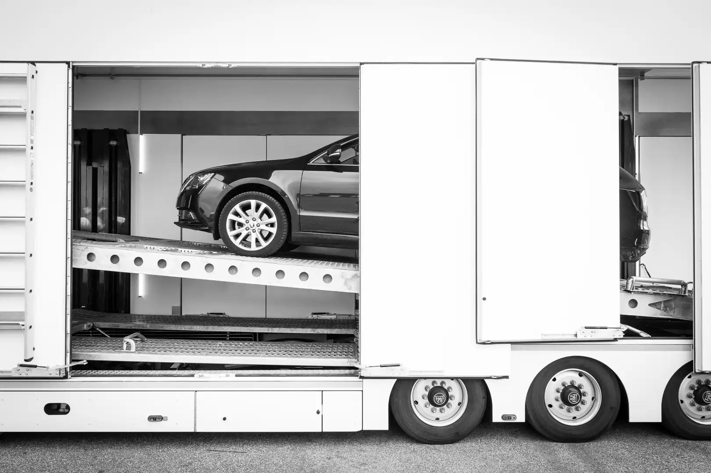
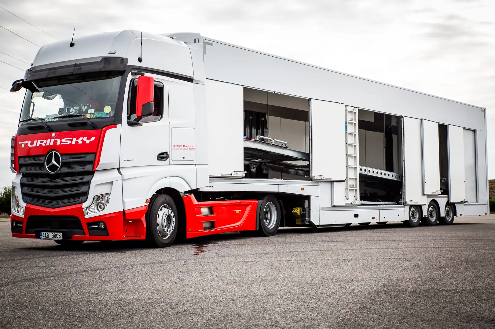
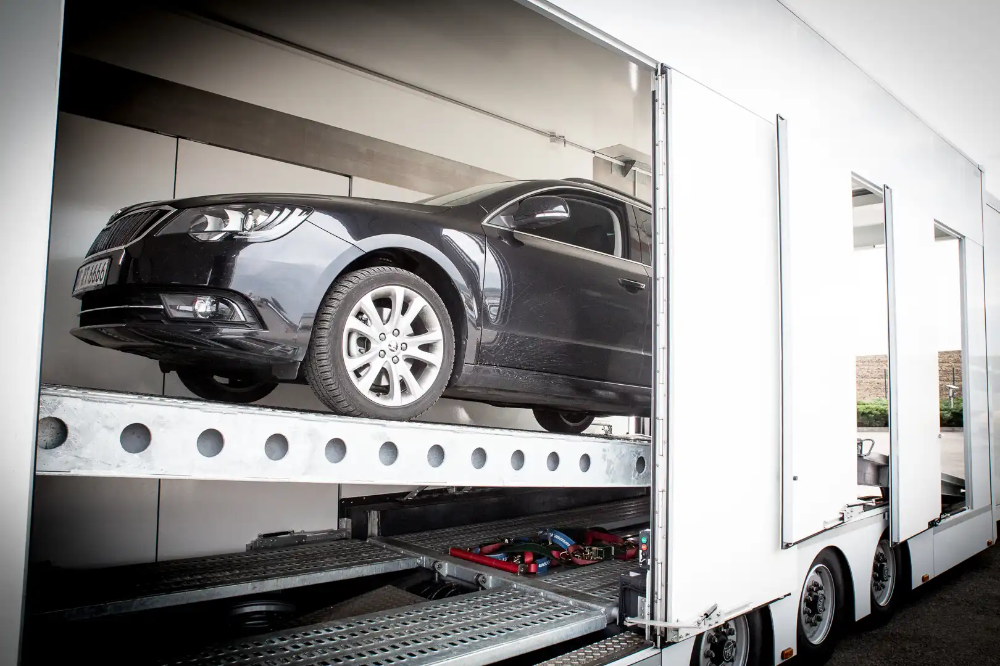
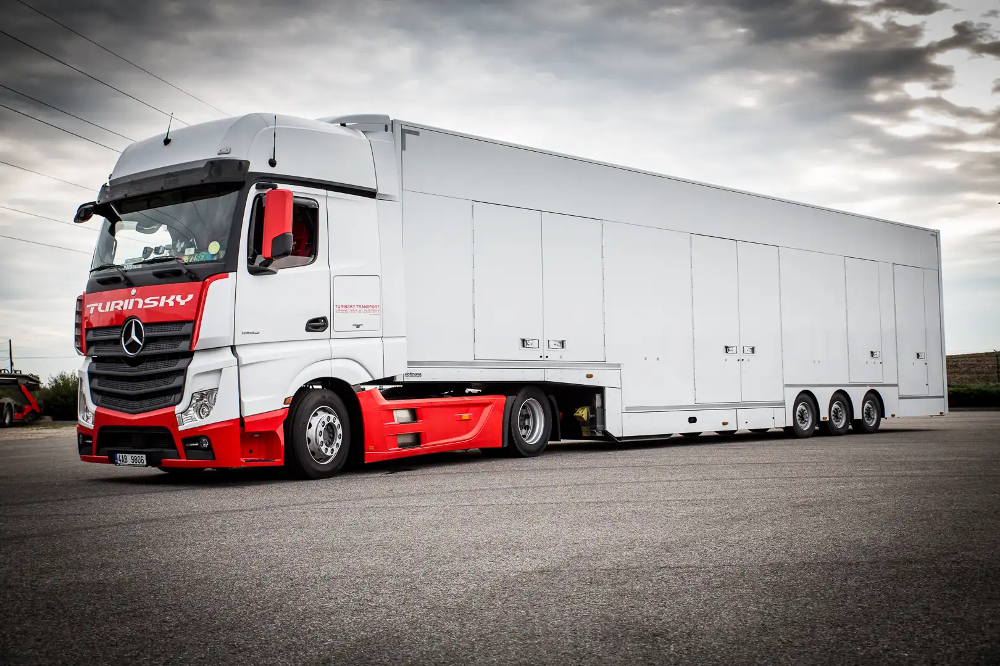
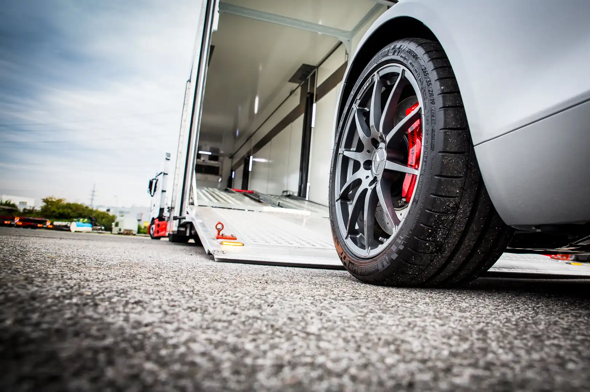

+++
title = 'Doprava v krytém vozidle'
date = 2023-01-01T08:00:00-07:00
draft = false
+++

# Doprava v krytém vozidle

**Pro speciální přání zakazníků nabízí společnost Turinsky Transport s.r.o. přepravu ve speciálním krytém vozidle.**

Tento způsob přepravy v zakrytém přepravníku představuje mnoho výhod, které ocení především majitelé veteránů, automobilových prototypů a sportovních nebo luxusních vozidel.

**Hlavní výhody zakryté přepravy:**

* Možnost přepravy při optimální a konstantní teplotě
* Ochrana před vlivy počasí a přepravy samotné (vítr, déšť, sníh, prach, nečistoty, ...)
* Vozidlo bude zabezpečeno před očima zvědavců
* Možnost sledování pomocí GPS - 24 hodin denně, 7 dní v týdnu

Pokud máte o tento speciální typ přepravy zájem, tak nás neváhejte kontaktovat. Náš tým Vám rád podá další informace.



