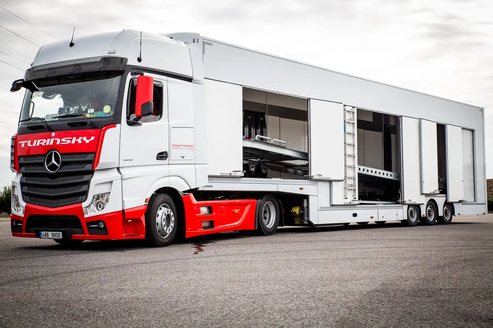

+++
title = 'Geschlossene Transporte'
date = 2023-01-01T08:00:00-07:00
draft = false
+++

# Geschlossene Transporte

**Auf ihren Wunsch hin kann der Transport in einem geschlossenen Fahrzeugtransporter durchgeführt werden.**

Um ihr Fahrzeug vor neugierigen Blicken zu schützen und um ihnen ein Maximum an Sicherheit zu ermöglichen, bieten wir ihnen unseren exklusiven Service des geschlossenen Transports an. Diskretion steht bei uns an erster Stelle daher verzichten wir auf große Reklame auf unseren Transportern um kein Aufsehen zu erregen. So ist Anonymität und Diskretion für ihre Fracht gewährleistet.

**Vorteile des geschlossenen Transports:**

* Klimageführte Transporte um eine optimale Transporttemperatur für Fahrzeug zu garantieren.
* Durch den geringen Auffahrwinkel ist auch der Transport von Rennfahrzeugen kein Problem
* Empfindliche Fahrzeuge wie z.B. Oldtimer und Luxusfahrzeuge werden vor Wind und Wetter geschützt und
* Ein GPS Überwachung ist in all unseren Fahrzeugen selbstverständlich



