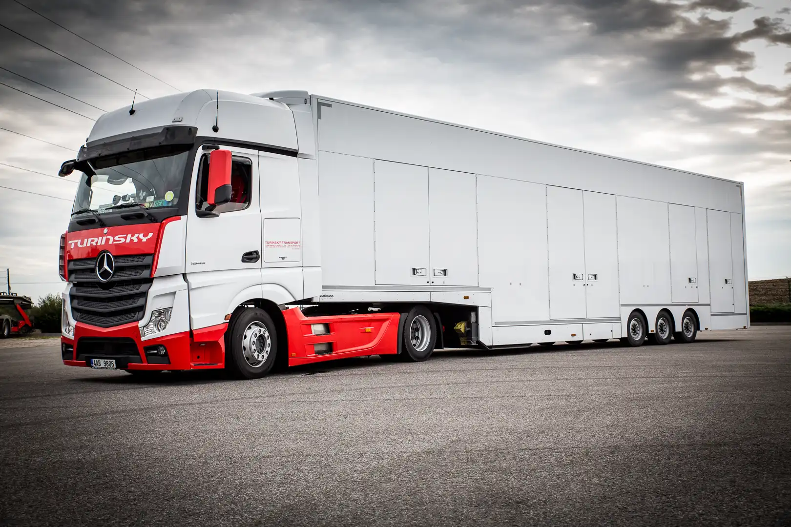
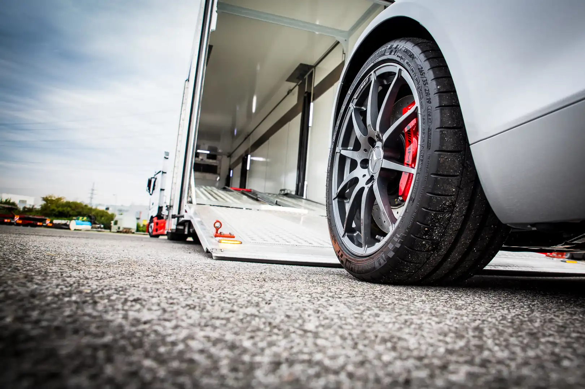

+++
title = 'Enclosed transports'
date = 2023-01-01T08:00:00-07:00
draft = false
+++

# Enclosed transports

**On your wish the transports can be provided with special covered car carriers.**

To enable maximum security and anonymity for your freight we would like to offer you the possibility of enclosed transports. Confidentiality is very important for us, therefore no big advertisements are on our trucks.

The advantages of covered are:

* The transports can be climate controlled so that you vehicle will be transported at stable and optimum temperature.
* A low loading angle allows us to transport even sports cars, and they do not need to be started as the possibility to winch them is given.
* As a matter of course all our carriers and equipped with GPS tracking.
* Suitable especially for luxury vehicles or classic car, as nobody will see your vehicle being transported.
* For further information please contact us.



